**[NOTE]** It looks like some dataset links are expired. I'm trying my best to recover them. If you happen to know the latest links, PRs are welcomed. 
# The Awesome Person Re-Identification Datasets
Person re-identification has drawn intensive attention in the computer vision society in recent decades. As far as we know, this page collects all public datasets that have been tested by person re-identification algorithms. If you use any of them, please refer to the original licence. If you have any suggestions or you want to include your dataset here, please open an issue or pull request. 

#### News
  - LPW, PKU Sketch-ReID and ThermalWorld added!
  - Moved to Github!
  - RPIfield added!
  - MSMT17 data added.
  - The code base for our benchmark paper is released! [GitHub](https://github.com/RSL-NEU/person-reid-benchmark)
  - Our paper on systematic evaluation and benchmark for person re-identification is accepted by T-PAMI! [Arxiv](http://arxiv.org/abs/1605.09653)
  - Airport dataset added.
  
| Dataset                   | Release time     | # identities | # cameras   | # images | Label method               | Crop size | Multi-shot | Tracking sequences | Full frames availability |
|---------------------------|------------------|--------------|-------------|----------|----------------------------|-----------|------------|--------------------|--------------------------|
| [VIPeR](#viper)                     | 2007             | 632          | 2           | 1264     | Hand                       | 128X48    |            |                    |                          |
| [ETH1,2,3](#eth1,2,3)                  | 2007             | 85, 35, 28     | 1           | 8580     | Hand                       | Vary      | ✔          | ✔                  | ✔                        |
| [QMUL iLIDS](#qmul-ilids)                | 2009             | 119          | 2           | 476      | Hand                       | Vary      | ✔          |                    |                          |
| [GRID](#grid)                      | 2009             | 1025         | 8           | 1275     | Hand                       | Vary      |            |                    |                          |
| [CAVIAR4ReID](#caviar4reid)               | 2011             | 72           | 2           | 1220     | Hand                       | Vary      | ✔          |                    |                          |
| [3DPeS](#3dpes)                     | 2011             | 192          | 8           | 1011     | Hand                       | Vary      | ✔          |                    | ✔*                       |
| [PRID2011](#prid2011)                  | 2011             | 934          | 2           | 24541    | Hand                       | 128X64    | ✔          | ✔                  | ✔*                       |
| [V47](#v47)                       | 2011             | 47           | 2           | 752      | Hand                       | Vary      | ✔          |                    | ✔                        |
| [WARD](#ward)                      | 2012             | 70           | 3           | 4786     | Hand                       | 128X48    | ✔          | ✔                  |                          |
| [SAIVT-Softbio](#saivt-softbio)             | 2012             | 152          | 8           | 64472    | Hand                       | Vary      | ✔          | ✔                  | ✔                        |
| [CUHK01](#cuhk01)                    | 2012             | 971          | 2           | 3884     | Hand                       | 160X60    | ✔          |                    |                          |
| [CUHK02](#cuhk02)                    | 2013             | 1816         | 10(5 pairs) | 7264     | Hand                       | 160X60    | ✔          |                    |                          |
| [CUHK03](#cuhk03)                    | 2014             | 1467         | 10(5 pairs) | 13164    | Hand/DPM                   | Vary      | ✔          |                    |                          |
| [RAiD](#raid)                      | 2014             | 43           | 4           | 6920     | Hand                       | 128X64    | ✔          |                    |                          |
| [iLIDS-VID](#ilids-vid)                 | 2014             | 300          | 2           | 42495    | Hand                       | Vary      | ✔          | ✔                  |                          |
| [MPR Drone](#mpr-drone)                 | 2014             | 84           | 1           |          | Pyramid Features(ACF)      | Vary      | ✔          |                    | ✔                        |
| [HDA Person Dataset](#hda-person-dataset)        | 2014             | 53           | 13          | 2976     | Hand/Pyramid Features(ACF) | Vary      | ✔          | ✔                  | ✔                        |
| [Shinpuhkan Dataset](#shinpuhkan-dataset)        | 2014             | 24           | 16          |          | Hand                       | 128X48    | ✔          | ✔                  |                          |
| [CASIA Gait Database B](#casia-gait-database-b)     | 2015(*see below) | 124          | 11          |          | Background subtraction     | Vary      | ✔          | ✔                  | ✔                        |
| [Market1501](#market1501)                | 2015             | 1501         | 6           | 32217    | Hand/DPM                   | 128X64    | ✔          |                    |                          |
| [PKU-Reid](#pku-reid)                  | 2016             | 114          | 2           | 1824     | Hand                       | 128X64    |            |                    |                          |
| [PRW](#prw)                       | 2016             | 932          | 6           | 34304    | Hand                       | vary      | ✔          |                    | ✔                        |
| [Large scale person search](#large-scale-person-search) | 2016             | 11934s       | -           | 34574    | Hand                       | vary      |            |                    | ✔                        |
| [MARS](#mars)                      | 2016             | 1261         | 6           | 1191003  | DPM+GMMCP                  | 256X128   | ✔          | ✔                  |                          |
| [DukeMTMC-reID](#dukemtmc-reid/dukemtmc4reid)             | 2017             | 1812         | 8           | 36441    | Hand                       | Vary      | ✔          |                    | ✔                        |
| [DukeMTMC4ReID](#dukemtmc-reid/dukemtmc4reid)             | 2017             | 1852         | 8           | 46261    | Doppia                     | Vary      | ✔          |                    | ✔                        |
| [Airport](#airport)                   | 2017             | 9651         | 6           | 39902    | ACF                        | 128X64    | ✔          |                    |                          |
| [MSMT17](#msmt17)                    | 2018             | 4101         | 15          | 126441   | Faster RCNN                | Vary      | ✔          |                    |                          |
| [RPIfield](#rpifield)   | 2018      | 112       | 12        | 601,581       | ACF       | Vary            | ✔                 |        ✔     |   
| [LPW](#lpw)             | 2018      | 2,731     | 3,4,4     | 592,438       | Detector+NN+Hand       | -            | ✔                 |        ✔     |          
| [PKU SketchRe-ID](#pku-sketchre-id)             | 2018      | 200           | 2       | 400          | Hand       | -            |                 |            |
| [ThermalWorld](#thermalworld)             | 2018      | 516           | 20       | 15,118          | Hand       | -            |                 |            |

# [VIPeR](https://vision.soe.ucsc.edu/node/178)
This dataset contains two cameras, each of which captures one image per person. It also provides the viewpoint angle of each image. Although it has been tested by many researchers, it's still one of the most challenging datasets. Ryan Layne provides the attribute annotation of VIPeR here.

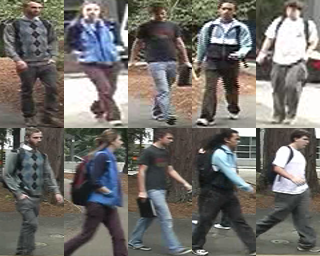
>D. Gray, and H. Tao, "Viewpoint Invariant Pedestrian Recognition with an Ensemble of Localized Features," in Proc. European Conference on Computer Vision (ECCV), 2008.
# [ETH1,2,3](http://homepages.dcc.ufmg.br/~william/datasets.html)
Different from other datasets collecting images from multiple cameras, ETHZ collects images from a moving camera. Although the viewpoint variance is relatively small, it does have considerable illumination variance, scale variance and occlusion.

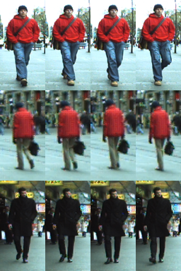
>W.R. Schwartz, L.S. Davis. Learning Discriminative Appearance-Based Models Using Partial Least Squares. Proceedings of the XXII Brazilian Symposium on Computer Graphics and Image Processing (SIBGRAPI'2009), Rio de Janeiro, Brazil, October 11-14, 2009.
# [QMUL iLIDS](http://www.eecs.qmul.ac.uk/~jason/data/i-LIDS_Pedestrian.tgz)
QMUL iLIDS is based on iLIDS MCTS, a dataset collected in an airport during busy time by a multi-camera CCTV system. Almost every identity has four images from two non-overlapping cameras. This dataset has senarios with heavy occlusion and pose variance.

>Zheng et al. Associating Groups of People, BMVC 2009
# [GRID](http://personal.ie.cuhk.edu.hk/~ccloy/downloads_qmul_underground_reid.html)
GRID is collected by 8 disjoint cameras in a busy underground station. Each identity has two images from different views and there are more images in the gallery set than the probe set. The image quality of this dataset is fairly poor.

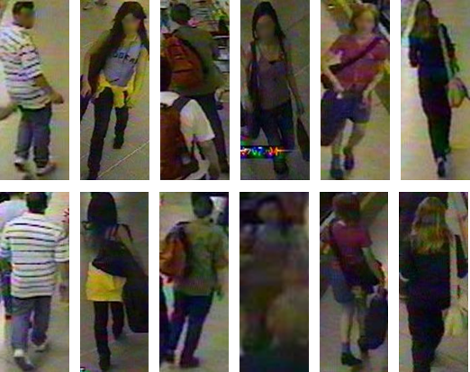
>Loy, C. C., Liu, C., & Gong, S. (2013, September). Person re-identification by manifold ranking. In 2013 IEEE International Conference on Image Processing (pp. 3567-3571). IEEE.
# [CAVIAR4ReID](https://lorisbaz.github.io/caviar4reid.html)
This dataset is extracted from a multi-target tracking dataset CAVIAR, which is collected in a shopping mall by two surveillance cameras with overlapped view field. Among 72 identities, 50 of them have images from two camera views and the rest 22 only from one camera. Images for each identity are carefully selected to maximize the resolustion variance.

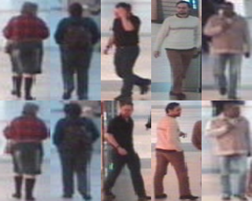
>Cheng, D. S., Cristani, M., Stoppa, M., Bazzani, L., & Murino, V. (2011, September). Custom Pictorial Structures for Re-identification. In BMVC (Vol. 1, No. 2, p. 6).
# [3DPeS](http://www.openvisor.org/3dpes.asp)
3DPeS dataset is collected by 8 non-overlapped outdoor cameras. Although the original video is provided, researchers always use the selected snapshots to test person re-identification algorithms. It has 3D model for the environment and the calibration data for all cameras. In video sequences, only the bounding boxes of the first appearing frame of each identity are provided.

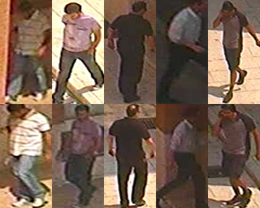
>Baltieri, D., Vezzani, R., & Cucchiara, R. (2011, December). 3dpes: 3d people dataset for surveillance and forensics. In Proceedings of the 2011 joint ACM workshop on Human gesture and behavior understanding (pp. 59-64). ACM.
# [PRID2011](https://www.tugraz.at/institute/icg/research/team-bischof/lrs/downloads/PRID11/)
PRID dataset has 385 trajectories from camera A and 749 trajectories from camera B. Among them, only 200 people appear in both cameras. This dataset also has a single shot version, which consists with random selected snapshots. Some trajectories are not well-synchronized, which means the person might "jump" between consecutive frames. 

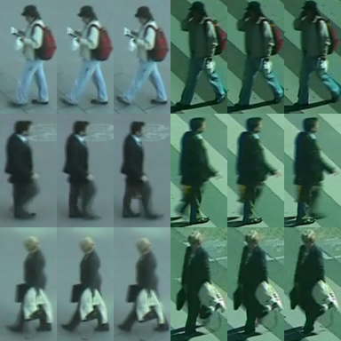
>Hirzer, M., Beleznai, C., Roth, P. M., & Bischof, H. (2011, May). Person re-identification by descriptive and discriminative classification. In Scandinavian conference on Image analysis (pp. 91-102). Springer Berlin Heidelberg.
# [V47](https://docs.google.com/leaf?id=0B692grTpU3UNZWZlN2I2NWYtYzdhNi00MWJkLWI0YjYtNTg2Zjk1OGFkMGQ1)
V47 dataset is collected using two indoor cameras with overlapped field of view. Each identity walks in two different directions (in and out) and is captured in several different viewpoints.

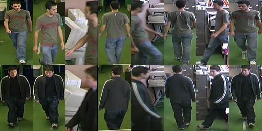
>Wang, S.M., Lewandowski, M., Annesley, J. and Orwell, J. (2011) Re-identification of pedestrians with variable occlusion and scale. In: IEEE International Conference on Computer Vision (ICCV);
# [WARD](https://github.com/iN1k1/CVPR2012/tree/master/toolbox/Datasets)
This dataset is collected with three non-overlaping cameras. Each identity has several images in each camera. Although the images seem to be a labeled trajectory, it's not guaranteed by the author.

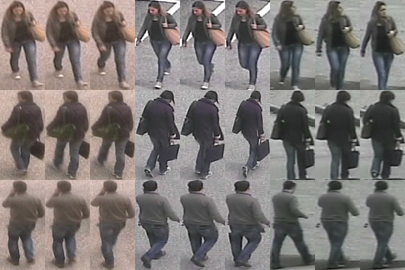
>Martinel, N., & Micheloni, C. (2012, June). Re-identify people in wide area camera network. In 2012 IEEE computer society conference on computer vision and pattern recognition workshops (pp. 31-36). IEEE.
# [SAIVT-Softbio](https://researchdatafinder.qut.edu.au/display/n27416)
SAIVT-Softbio is collected by eight existing surveillance cameras. Since it's an uncontrolled collection, most identities only pass through a subset of cameras. This dataset also provides the whole video frames with labeled bounding box on every frame, but the bounding boxes are not very tight for some instances.

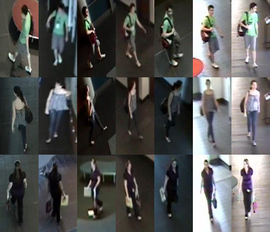
>Bialkowski, Alina, Denman, Simon, Lucey, Patrick, Sridharan, Sridha, & Fookes, Clinton B. (2012) A database for person re-identification in multi-camera surveillance networks. In Proceedings of the 2012 International Conference on Digital Image Computing Techniques and Applications (DICTA 12), IEEE, Esplanade Hotel, Fremantle, WA, pp. 1-8.
# [CUHK01](http://www.ee.cuhk.edu.hk/~xgwang/CUHK_identification.html)
CUHK01 dataset contains two images for every identity from each camera. This dataset has one pair disjoint cameras and the image quality of this dataset is relatively good.

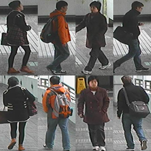
>W. Li, R. Zhao and X. Wang, "Human Reidentification with Transferred Metric Learning" in Proceedings of Asian Conference on Computer Vision (ACCV) 2012.
# [CUHK02](http://www.ee.cuhk.edu.hk/~xgwang/CUHK_identification.html)
CUHK02 is an extended dataset from CUHK01. Besides the camera pair in CUHK01, it has four more camera pair settings.

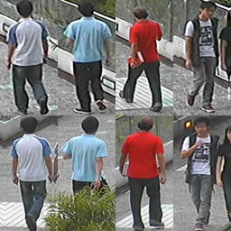
>W. Li and X. Wang, "Locally Aligned Feature Transforms across Views" in Proceedings of IEEE Computer Society Conference on Computer Vision and Pattern Recognition (CVPR) 2013.
# [CUHK03](http://www.ee.cuhk.edu.hk/~xgwang/CUHK_identification.html)
CUHK03 is the first person re-identification dataset that is large enough for deep learning. It provides the bounding boxes detected from deformable part models (DPM) and manually labeling. Person detection quality is relatively good for this dataset.

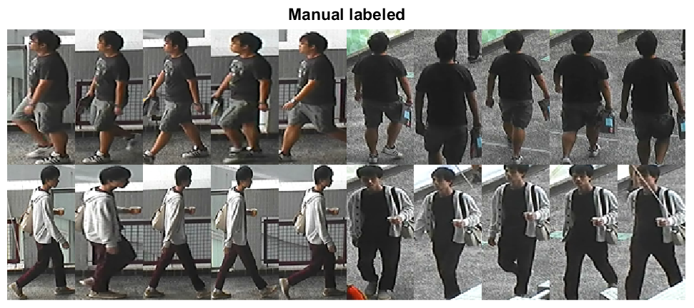
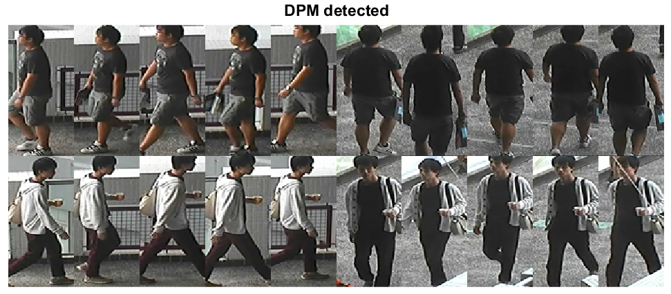
>Li, W., Zhao, R., Xiao, T., & Wang, X. (2014). Deepreid: Deep filter pairing neural network for person re-identification. In Proceedings of the IEEE Conference on Computer Vision and Pattern Recognition (pp. 152-159).
# [RAiD](http://cs-people.bu.edu/dasabir/raid.php)
As a relatively new released dataset, RAiD guaranteed each identity has images in all four non-overlaping cameras. Since two cameras are indoor and the other two are outdoor, the illumination variance is considerably large. Images of each identity are collected in a tracking manner, but the order is not always consistent.

>Das, A., Chakraborty, A., & Roy-Chowdhury, A. K. (2014, September). Consistent re-identification in a camera network. In European Conference on Computer Vision (pp. 330-345). Springer International Publishing.
# [iLIDS-VID](http://www.eecs.qmul.ac.uk/~xiatian/downloads_qmul_iLIDS-VID_ReID_dataset.html)
Based on the assumption that the real person re-identification system should have the trajectory for each identity, iLIDS-VID dataset extracted 600 trajectories for 300 identities from iLIDS MCTS dataset. Due to the limitation of iLIDS MCTS dataset, iLIDS-VID has extremely heavy occlusion.

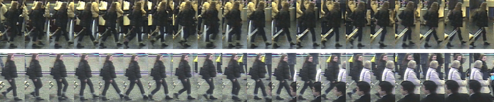
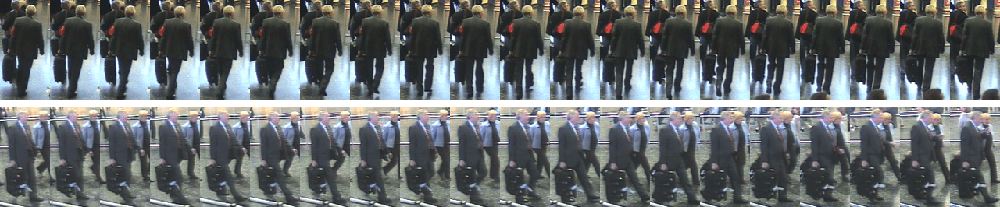
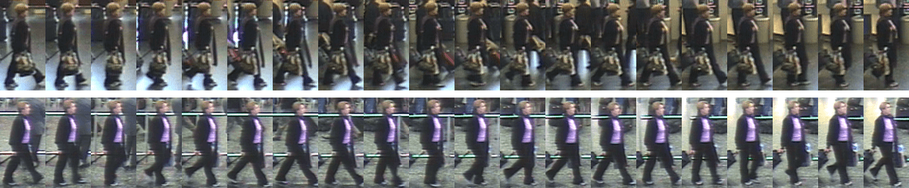
>Wang, T., Gong, S., Zhu, X., & Wang, S. (2016). Person Re-Identification by Discriminative Selection in Video Ranking.
# [MPR Drone](http://www.eecs.qmul.ac.uk/~rlayne/downloads_qmul_drone_dataset.html)
MPR Drone dataset is not a traditional person person re-identification dataset with images captured across a camera network. Instead, it is collected by a flying drone in both indoor and outdoor environment. Since it only has one camera, the author proposed three different types of evaluation experiments in the original paper. All pedestrian detections are obtained by pyramid feature detection in Piotr Dollar's toolbox. It has two sub-datasets. Dataset 01 has been exhaustively labeled for 113610 detections. Dataset 02 provides the raw frame data for Dataset 01.

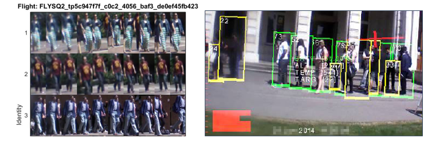
>Layne, R., Hospedales, T. M., & Gong, S. (2014, September). Investigating Open-World Person Re-identification Using a Drone. In European Conference on Computer Vision (pp. 225-240). Springer International Publishing.
# [HDA Person Dataset](http://vislab.isr.ist.utl.pt/hda-dataset/)
HDA dataset is proposed to mimic the real person re-identification system as close as possible. Within it, 85 persons were densely labeled across 13 cameras during 30 mins. In addition to the tight bounding boxes, the author also proivdes the occlusion flag, camera homographies and synchronization. Image qualities are vary from 640x480 to 2560x1600 and FPSs are vary from 1 to 5. A nice evaluation tool is provided to test the re-id algorithm, person detector or both of them. Six different protocols are included to analysis the whole re-id system. Detections from ACF are provided.

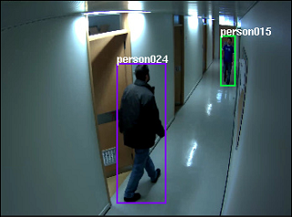
>Figueira, D., Taiana, M., Nambiar, A., Nascimento, J., & Bernardino, A. (2014, September). The hda+ data set for research on fully automated re-identification systems. In European Conference on Computer Vision (pp. 241-255). Springer International Publishing.
# [Shinpuhkan Dataset](http://www.mm.media.kyoto-u.ac.jp/en/datasets/shinpuhkan/)
Shinpuhkan dataset was orginally created to test multi-camera tracking methods. Each person has multiple tracklets in different directions within each camera. In total, each identity has 86 annotated tracklets. The image quality seems fairly good comparing with other tranditional re-id datasets.

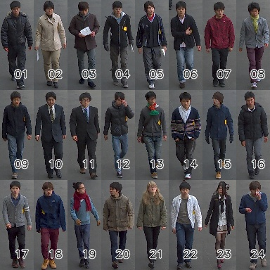
>Kawanishi, Y., Wu, Y., Mukunoki, M., & Minoh, M. (2014). Shinpuhkan2014: A multi-camera pedestrian dataset for tracking people across multiple cameras. In 20th Korea-Japan Joint Workshop on Frontiers of Computer Vision (Vol. 5, p. 6).
# [CASIA Gait Database B](http://www.cbsr.ia.ac.cn/english/Gait%20Databases.asp)
CASIA dataset was created in 2005 and originally used to test gait recognition algorithm. In 2015, Liu et.al reused this dataset to test a gait-based person re-identification algorithm. This dataset is collected by 11 overlapped cameras in different view angles from 0 to 180 degree. Each identity also changes the clothing and carrying condition. Instead of providing bounding boxes, the raw video frames and the silhouette of each frame are given.

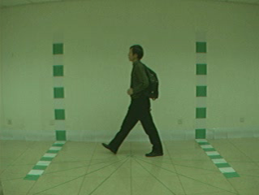
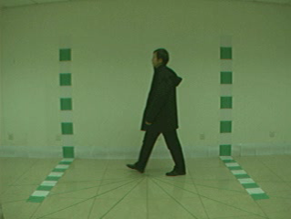
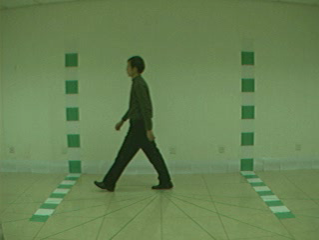
# [Market1501](http://www.liangzheng.com.cn/Project/project_reid.html)
It contains a large number of identities and each identity has several images from six dis-joint cameras. This dataset also includes 2793 false alarms from DPM as distractors to mimic the real scenario. Quality of the bounding boxes is worse than CUHK03. Later in the ICCV 2015 release version, 500K distractors are integrated to make this dataset really large scale. In the original paper proposed this dataset, the author also used mAP as an evalution criteria to test the algorithms.

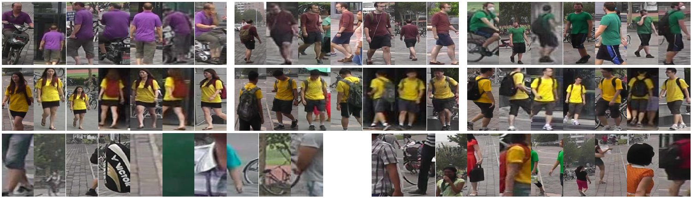
>Zheng, L., Shen, L., Tian, L., Wang, S., Wang, J., & Tian, Q. (2015). Scalable person re-identification: A benchmark. In Proceedings of the IEEE International Conference on Computer Vision (pp. 1116-1124).
# [PKU-Reid](https://github.com/charliememory/PKU-Reid-Dataset)
PKU-Reid dataset is relatively small comparing with other modern re-id datasets. The key feature of this dataset is that it captures person appearance from all eight orientations in two disjoint cameras.

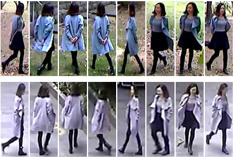
>Ma, L., Liu, H., Hu, L., Wang, C., & Sun, Q. (2016). Orientation Driven Bag of Appearances for Person Re-identification. arXiv preprint arXiv:1605.02464.
# [PRW](http://www.liangzheng.org/Project/project_prw.html)
The PRW (Person Re-identification in the Wild) dataset is an extenstion of Maretk1501 dataset. Instead of only provide bounding boxes, the author released the full frames with annotations. Therefore one can evaluate the affact of different person detectors.

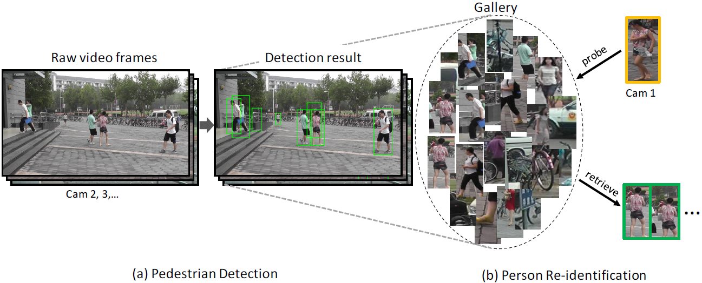
>Zheng, L., Zhang, H., Sun, S., Chandraker, M., & Tian, Q. (2016). Person Re-identification in the Wild. arXiv preprint arXiv:1604.02531.
# [Large scale person search](http://www.ee.cuhk.edu.hk/~xgwang/PS/dataset.html)
Similar to PRW dataset, the person search dataset is large scale dataset with full frame access and large amount of labeled bounding boxes. It aims to mimic the real scenario of person search. Therefore, to test this dataset, a reliable person detector is needed. To make the dataset more difficult, the gallery part includes frames from hand held camera and movies. Two more subsets, low-resolution subset and occlusion subset, are also released to evalution the affect of those factors.

>Xiao, T., Li, S., Wang, B., Lin, L., & Wang, X. (2016). End-to-End Deep Learning for Person Search. arXiv preprint arXiv:1604.01850.
# [MARS](http://www.liangzheng.com.cn/Project/project_mars.html)
The MARS (Motion Analysis and Re-identification Set) dataset is an extenstion verion of the Market1501 dataset. It is the first large scale video based person re-id datset. Since all bounding boxes and tracklets are generated automatically, it contains distractors and each identity may have more than one tracklets. Precomputed deep features are also avaliable on the website.

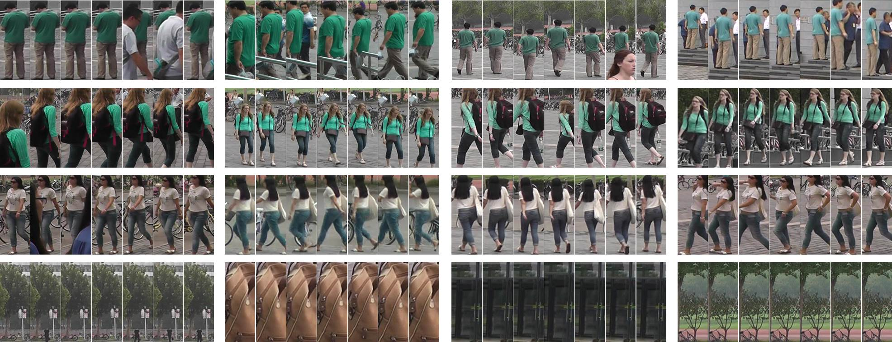
>Zheng, L., Bie, Z., Sun, Y., Wang, J., Su, C., Wang, S., & Tian, Q. (2016, October). Mars: A video benchmark for large-scale person re-identification. In European Conference on Computer Vision (pp. 868-884). Springer International Publishing.
# [DukeMTMC-reID/DukeMTMC4ReID](http://vision.cs.duke.edu/DukeMTMC/)
The DukeMTMC dataset is a large-scale heavily labeled multi-target multi-camera tracking dataset. In total, more than 2700 people were labeled with unique identities in 8 cameras. With the access to all information (full frames, frame level ground truth, calibration information, etc.), this dataset has a lot of protentials. Based on the released train-validation set, two re-id extension datasets are created. The key difference is the way to generate the bounding boxes. DukeMTMC-reID directly uses the manually labeled ground truth whereas DukeMTMC4ReID adopts Doppia as the person detector.
#### DukeMTMC-reID

>Zheng, Zhedong, Liang Zheng, and Yi Yang. "Unlabeled samples generated by gan improve the person re-identification baseline in vitro." arXiv preprint arXiv:1701.07717 (2017).
#### DukeMTMC4ReID

>Gou, Mengran and Karanam, Srikrishna and Liu, Wenqian and Camps, Octavia and Radke, Richard J. "DukeMTMC4ReID: A Large-Scale Multi-Camera Person Re-Identification Dataset." CVPR Workshops (2017)
# [Airport](http://www.northeastern.edu/alert/transitioning-technology/alert-datasets/alert-airport-re-identification-dataset/)
The dataset was created using videos from six cameras of an indoor surveillance network in a mid-sized airport. The cameras cover various parts of a central security checkpoint area and three concourses. Each camera has 768 × 432 pixels and captures video at 30 frames per second. 12-hour long videos from 8 AM to 8 PM were collected from each of these cameras. Under the assumption that each target person takes a limited amount of time to travel through the network, each of these long videos was randomly split into 40 five minute long video clips. Each video clip was then run through a prototype end-to- end re-id system comprised of automatic person detection and tracking algorithms.

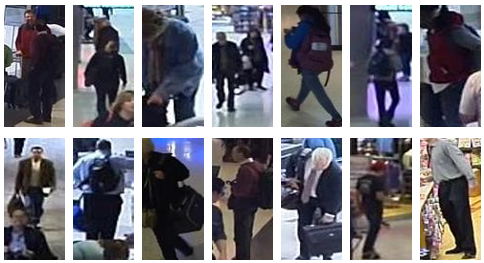
>Karanam, S., Gou, M., Wu, Z., Rates-Borras, A., Camps, O., & Radke, R. J. (2018). IEEE Transactions on Pattern Analysis and Machine Intelligence, 2018.
# [MSMT17](http://www.pkuvmc.com/publications/msmt17.html)
This large scale re-id dataset is collected in a campus with 12 outdoor cameras and 3 indoor cameras. It coveres 4 days with different weather in a month. For each day, 3 one-hour videos are selected from morning, noon and afternoon. Faster RCNN is utilized for pedestrian detection. This dataset is the largest re-id dataset so far. It has similar viewpoint with Market, but much more complicated scenarios.

>Wei, L., Zhang, S., Gao, W., & Tian, Q. (2018). Person Transfer GAN to Bridge Domain Gap for Person Re-Identification. Computer Vision and Pattern Recognition, IEEE International Conference on, 2018

# [RPIfield](https://drive.google.com/file/d/1GO1zm7vCAJwXgJtoFyUs367_Knz8Ev0A/view?usp=sharing)
RPIfield is a new re-id dataset, which provides explicit time-stamp information for each person, thus helping evaluate re-id algorithms based on their temporal performance on a dynamic gallery populated by an increasing number of candidates (some of whom may return several times over a long duration).

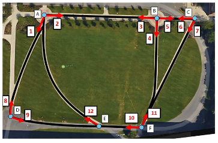
>Zheng, Meng and Karanam, Srikrishna and Radke, Richard J. "RPIfield: A New Dataset for Temporally Evaluating Person Re-Identification." CVPR Workshops (2018) 

# [LPW](http://liuyu.us/dataset/lpw/index.html)
Labeled Pedestrian in the Wild is a video based re-id dataset. It's collected in three scenes on the street. The identities include adults and children and the poses vary from running to cycling. The dataset has been manually cleaned up to remove failed detections and tracklets.

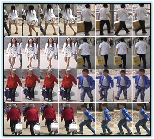
>Guanglu Song, Biao Leng, Yu Liu, Congrui Hetang, Shaofan Cai. "Region-based Quality Estimation Network for Large-Scale Person Re-identification." AAAI (2018)

# [PKU Sketch-ReID](https://www.pkuml.org/resources/pkusketchreid-dataset.html)
This dataset contains 200 persons, each of which has one sketch and two photos. Photos of each person were captured during daytime by two cross-view cameras. The raw images (or video frames) are cropped manually to make sure that every photo contains one specific person. There are 5 artists to draw all persons’ sketches and every artist has his own painting style. 

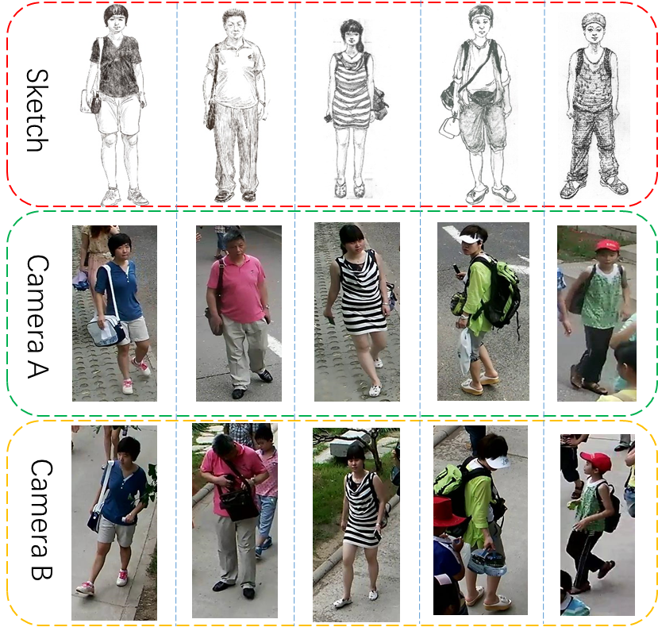
>Lu Pang, Yaowei Wang, Yi-Zhe Song, Tiejun Huang, Yonghong Tian. "Cross-Domain Adversarial Feature Learning for Sketch Re-identification"; ACM Multimedia (2018) 

# [ThermalWorld](http://www.zefirus.org/ThermalGAN/)
This is a cross-modality re-id dataset with thermal-color image pairs. Pixel level annotations are provided. 

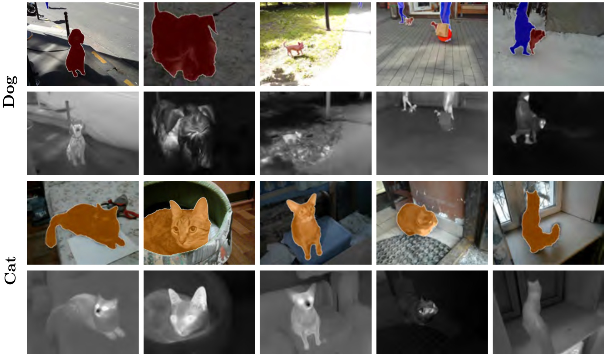
>Kniaz, Vladimir V. and Knyaz, Vladimir A. and Hladuvka, Jiri and Kropatsch, Walter G. and Mizginov, Vladimir A. "ThermalGAN: Multimodal Color-to-Thermal Image Translation for Person Re-Identification in Multispectral Dataset." ECCV Workshop (2018)
